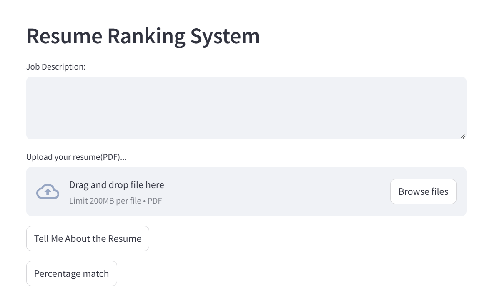
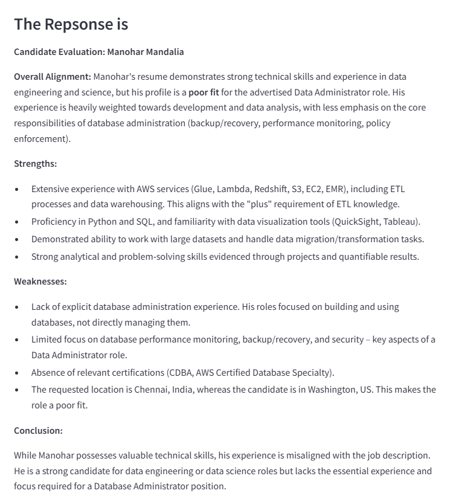
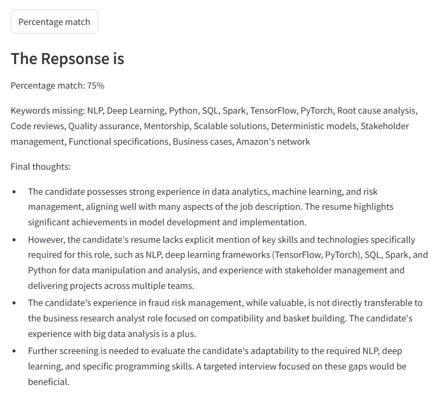

# 📄 Resume Ranking System using Gemini API

This project is a smart **Resume Ranking System** that helps recruiters screen resumes by analyzing their relevance to job descriptions using **Gemini Pro (Generative AI)**.

It offers two core functionalities:
1. ✍️ **"Tell Me About the Resume"** – Gives a comprehensive candidate evaluation
2. 📊 **"Percentage Match"** – Returns a skill-based match score and missing keyword list

---

## 🖼️ Interface Snapshots

### 📝 User Interface (Streamlit)

Users can paste a job description and upload a resume (PDF format).



---

### 🧠 Gemini-Powered Summary Output

A detailed evaluation is returned including strengths, weaknesses, and final verdict.



---

### 📉 Skill Match & Percentage Score

The system highlights how well a resume matches a job description, what skills are missing, and gives final screening thoughts.



---

## 🧠 Powered by Gemini API

This app leverages Google’s **Gemini Pro API** for:
- **Text extraction from PDFs**
- **Semantic understanding of resume vs job description**
- **Personalized, recruiter-style candidate feedback**

---

## 🎯 Target Users

- 🔍 **Recruiters/HRs**: Shortlist candidates faster
- 🧑‍💼 **Job Seekers**: Evaluate how well their resume fits a specific role
- 🧪 **Career Coaches**: Guide clients on resume optimization

---

## 🛠 Features

- 📄 Upload **PDF resumes**
- 📌 Paste or type **job descriptions**
- 🧠 AI-generated:
  - Strengths & weaknesses
  - Role alignment
  - Recommendations
- ✅ **Percentage-based resume ranking**
- 🔍 Highlights **missing keywords/skills**

---

## 🧑‍💼 Prompt Engineering Tips

Better results are obtained by:
- Specifying job **persona** (e.g., “hiring manager at Amazon”)
- Including **skills**, **tools**, and **responsibilities** in job description
- Feeding realistic resume formats (avoid noisy templates)

---

## 🧰 Tech Stack

| Component        | Tech                          |
|------------------|-------------------------------|
| Backend Logic    | Python, Gemini Pro API        |
| UI Framework     | Streamlit                     |
| PDF Parsing      | `pdfplumber`, `PyMuPDF`       |
| AI Evaluation    | Gemini Pro via prompt chaining|

---

## 🚀 How to Run Locally

### 1. Clone the repository
```bash
git clone https://github.com/yourusername/resume-ranking-system.git
cd resume-ranking-system
````

### 2. Install dependencies

```bash
pip install -r requirements.txt
```

### 3. Set your API key (Gemini)

```bash
export GEMINI_API_KEY="your-api-key"
```

### 4. Run the app

```bash
streamlit run app.py
```

---

## 📈 Example Use Case

**Job Description:**

```
Looking for a data engineer with experience in AWS, Redshift, Python, and database backup/recovery. Preferred certifications: AWS Database Specialty.
```

**Resume Upload:** `Manohar_Mandalia_Resume.pdf`

**Output:**

* Poor fit for database admin, better suited for data science
* Strength in AWS Glue, S3, EMR, Python, SQL
* Missing: certifications, database monitoring, location mismatch

---

## 📄 Output Interpretation

### Mode 1: Tell Me About the Resume

* Semantic summary & recruiter-style evaluation
* Tailored strengths & weaknesses

### Mode 2: Percentage Match

* % match to job description
* Missing keyword list
* Final hiring suggestion

---

## 📌 Limitations

* Output depends heavily on **resume formatting quality**
* Better **prompts** = better insights
* Works best with **structured job descriptions**

---

## 📃 License

MIT License © 2025 \Swxpb1863

---

## 🤝 Contributions Welcome

PRs and feedback are welcome to expand this project into a full-scale Resume Intelligence System!

```
